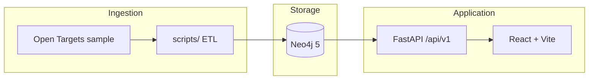

# BioInsight Graph

**Disease–target knowledge graph** — ingest public association data into Neo4j, query via FastAPI, explore with a React/TypeScript UI.

[](https://github.com/LordKay-sudo/bioinsight-graph/actions/workflows/ci.yml)
[](LICENSE)
[](api/requirements.txt)
[](docker-compose.yml)
[](api/app/main.py)
[](web/package.json)

---

## Overview

BioInsight Graph models how research datasets can become **queryable knowledge graphs**: structured ETL from open biomedical associations → Neo4j storage → documented REST API → researcher-facing explorer.

| Capability | Status |
|------------|--------|
| Neo4j via Docker + schema constraints | ✅ |
| Open Targets–style seed pipeline | ✅ |
| FastAPI search & neighbor endpoints | ✅ |
| React search + gene detail UI | ✅ |
| Force-directed graph view | ✅ |
| Full Docker Compose stack | ✅ |
| GitHub Actions CI | ✅ |

**Data (MVP):** Representative sample inspired by [Open Targets](https://www.opentargets.org/) — 30+ genes, 12 diseases, 105 disease–target associations, 10 protein links. Suitable for demos; not clinical-grade.


---

## Quick start

**Prerequisites:** [Docker Desktop](https://www.docker.com/products/docker-desktop/), Python 3.11+ (`py -3`), Node.js 20+.

```bash
git clone https://github.com/LordKay-sudo/bioinsight-graph.git
cd bioinsight-graph
cp .env.example .env

# 1 — Graph database
docker compose up -d neo4j

# 2 — Seed (from repo root, using api venv)
cd api && py -3 -m venv .venv
.\.venv\Scripts\pip install -r requirements.txt   # Windows
cd ..\scripts
..\api\.venv\Scripts\python download_sample.py
..\api\.venv\Scripts\python etl_opentargets.py
..\api\.venv\Scripts\python seed_neo4j.py

# 3 — API
cd ..\api
.\.venv\Scripts\uvicorn app.main:app --reload --port 8000

# 4 — Web (new terminal)
cd web && npm install && npm run dev
```

| Service | URL |
|---------|-----|
| Web UI | http://localhost:5173 |
| API docs | http://localhost:8000/docs |
| Neo4j Browser | http://localhost:7474 (`neo4j` / `changeme`) |

Try searching **BRCA1** in the UI, then open the gene detail view for associated diseases and proteins.

### Docker (all-in-one)

Runs Neo4j, seeds sample data, API, and nginx-served web UI:

```bash
docker compose up --build
```

| Service | URL |
|---------|-----|
| **Web UI** | http://localhost:8080 |
| API docs | http://localhost:8000/docs |
| Neo4j Browser | http://localhost:7474 |

The `seed` service runs once per `compose up` (loads Open Targets–style sample data). To re-seed:

```bash
docker compose run --rm seed
```

---

## Architecture



---

## Graph model

```cypher
(:Gene {id, symbol, name})
(:Disease {id, name})
(:Protein {id, name})

(:Gene)-[:ASSOCIATED_WITH {score, source}]->(:Disease)
(:Protein)-[:ENCODED_BY]->(:Gene)
```

Unique constraints on `Gene.id`, `Disease.id`, and `Protein.id` — see `scripts/neo4j/init.cypher`.

---

## API

Base path: **`/api/v1`** · Interactive docs at **`/docs`** when the API is running.

| Method | Endpoint | Description |
|--------|----------|-------------|
| `GET` | `/health` | Liveness + Neo4j connectivity |
| `GET` | `/stats` | Node and relationship counts |
| `GET` | `/genes?q=` | Search genes by symbol or name |
| `GET` | `/diseases?q=` | Search diseases |
| `GET` | `/genes/{id}` | Gene metadata + degree counts |
| `GET` | `/genes/{id}/neighbors` | 1-hop subgraph (JSON nodes + edges) |
| `GET` | `/export/subgraph?gene_id=` | Subgraph for force-directed visualization |

---

## Web application

| Route | Page |
|-------|------|
| `/` | Search genes and diseases (debounced, tabbed) |
| `/gene/:id` | Gene detail — graph view + neighbor table |
| `/about` | Data provenance, schema, limitations |


Full gene detail page (stats + graph + legend): [screenshot-gene-detail.png](docs/screenshot-gene-detail.png)

Stack: React 18, TypeScript, Vite. Dev server proxies `/api` → `localhost:8000`.

---

## Repository layout

```
bioinsight-graph/
├── .github/workflows/ci.yml
├── api/              # FastAPI + Dockerfile
├── web/              # React + nginx Dockerfile
├── scripts/          # download → ETL → seed_neo4j
├── docs/             # README screenshots
├── docker-compose.yml
├── Dockerfile.seed   # one-shot graph seed job
└── .env.example
```

---

## Development

```bash
# API tests (mocked Neo4j)
cd api && .\.venv\Scripts\python -m pytest -q

# Lint/typecheck web (Node 20+)
cd web && npm run build
```

### Roadmap

| Phase | Focus |
|-------|--------|
| 0–2 | Neo4j, ETL, FastAPI ✅ |
| 3 | React search + gene detail ✅ |
| 4 | Graph visualization + `/export/subgraph` ✅ |
| 5 | Docker Compose (api + web + neo4j + seed) ✅ |
| 6 | GitHub Actions CI ✅ |

**Related project:** [kg-rag-demo](https://github.com/LordKay-sudo/kg-rag-demo) — unstructured documents → knowledge graph → RAG Q&A.

---

## License

[MIT](LICENSE) © 2026 LordKay-sudo
